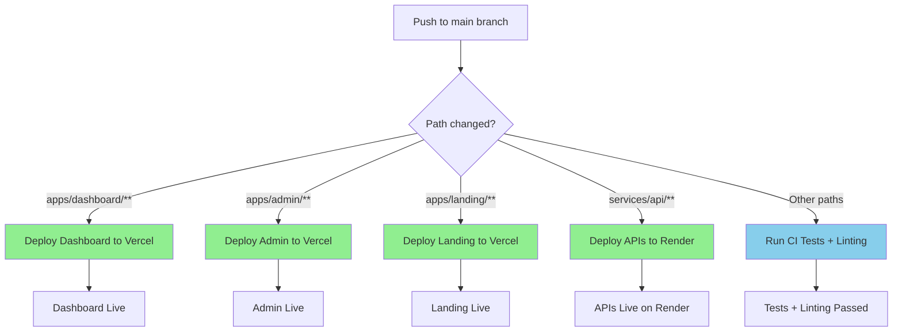

# CI/CD Documentation

## Overview

This document describes the Continuous Integration and Continuous Deployment (CI/CD) setup for the Procurement system. The project uses a **monorepo structure** with **path-based deployment triggers** and **Vercel** as the primary deployment platform.

## Architecture

### Repository Structure
```
Procurement/
├── apps/
│   ├── dashboard/     # Main dashboard application
│   ├── admin/         # Admin interface
│   ├── landing/       # Landing page
│   └── api/           # Backend API services
├── services/
│   └── api/           # Additional API services
└── .github/workflows/ # GitHub Actions workflows
```

### Deployment Strategy
- **Platform**: Vercel for all frontend applications
- **Trigger Strategy**: Path-based (only deploys when specific app directories change)
- **Environment**: Production environment protection enabled
- **Node Version**: 18.x across all workflows

## Workflows

### 1. Main CI Pipeline (`ci.yml`)

**Purpose**: Testing and validation for the entire codebase

**Triggers**:
- Push to `main` branch (excluding dashboard changes)
- Pull requests to `main`

**Current Configuration**:
- ✅ **Enabled**: Basic testing and dashboard build validation
- ❌ **Disabled**: Linting (commented out for focus on deployment)
- 🔧 **Node.js**: Version 18
- 🧹 **Dependencies**: Clean install for all workspaces

**Steps**:
1. Checkout code
2. Setup Node.js 18
3. Clean install dependencies for all apps
4. Build dashboard application
5. Validate build output

### 2. Dashboard Deployment (`deploy-dashboard.yml`)

**Purpose**: Deploy the main dashboard application

**Triggers**:
- Push to `main` branch with changes in `apps/dashboard/**`

**Status**: ✅ **Active**

**Deployment Flow**:
1. Checkout code
2. Setup Node.js 18 with npm caching
3. Install dependencies (`npm ci`)
4. Build dashboard (`npm run build --workspace=apps/dashboard`)
5. Deploy to Vercel

**Required Secrets**:
- `VERCEL_TOKEN`
- `VERCEL_ORG_ID`
- `VERCEL_PROJECT_ID`

### 3. Admin Deployment (`deploy-admin.yml`)

**Purpose**: Deploy the admin interface

**Triggers**:
- Push to `main` branch with changes in `apps/admin/**`
- Manual trigger via workflow_dispatch

**Status**: ✅ **Enabled** (workflow_dispatch active)

**Deployment Flow**:
1. Checkout code
2. Setup Node.js 18 with npm caching
3. Install dependencies (`npm ci`)
4. Build admin (`npm run build --workspace=apps/admin`)
5. Deploy to Vercel

**Required Secrets**:
- `VERCEL_TOKEN`
- `VERCEL_ORG_ID`
- `VERCEL_ADMIN_PROJECT_ID`

### 4. Landing Deployment (`deploy-landing.yml`)

**Purpose**: Deploy the landing page

**Triggers**:
- Push to `main` branch with changes in `apps/landing/**`
- Manual trigger via workflow_dispatch

**Status**: ✅ **Enabled** (workflow_dispatch active)

**Deployment Flow**:
1. Checkout code
2. Setup Node.js 18 with npm caching
3. Install dependencies (`npm ci`)
4. Build landing (`npm run build --workspace=apps/landing`)
5. Deploy to Vercel

**Required Secrets**:
- `VERCEL_TOKEN`
- `VERCEL_ORG_ID`
- `VERCEL_LANDING_PROJECT_ID`

### 5. API Deployment (`deploy-api.yml`)

**Purpose**: Deploy API services to Render

**Triggers**:
- Push to `main` branch with changes in `services/api/**`
- Manual trigger via workflow_dispatch

**Status**: ✅ **Fixed and Active**

**Deployment Flow**:
1. **Booking Integration Service**: FastAPI service for Azure SQL to Supabase sync
2. **ETL Service**: Data transformation pipeline
3. **Nanonets Webhook**: Document processing webhook

**Required Secrets**:
- `RENDER_API_KEY`
- `RENDER_BOOKING_SERVICE_ID`
- `RENDER_ETL_SERVICE_ID`
- `RENDER_NANONETS_SERVICE_ID`

## Current Workflow Flow



## Issues and Recommendations

### ✅ **FIXED ISSUES**

1. **API Deployment Configuration** ✅
   - ✅ Rewritten `deploy-api.yml` with proper API deployment logic
   - ✅ Added support for multiple API services (Booking Integration, ETL, Nanonets)
   - ✅ Configured for Render deployment platform

2. **Disabled Deployments** ✅
   - ✅ Enabled Admin deployment (workflow_dispatch active)
   - ✅ Enabled Landing deployment (workflow_dispatch active)

3. **Build Process Standardization** ✅
   - ✅ Standardized dependency installation across all workflows
   - ✅ Consistent use of `npm ci` with proper caching
   - ✅ Unified build commands using workspace syntax

4. **Linting Re-enabled** ✅
   - ✅ Re-enabled linting in CI pipeline
   - ✅ Added comprehensive build testing for all applications

### 🔧 **Remaining Recommendations**

1. **Environment Variables Setup**
   - Configure Render API keys and service IDs
   - Set up proper environment variables for API services
   - **Action Required**: Add secrets to GitHub repository

2. **Monitoring and Alerting**
   - Add deployment notifications
   - Set up monitoring for API services
   - **Recommendation**: Implement health checks and alerting

### 📋 **Next Steps**

1. **Configure Render Secrets** (Required for API deployments)
   ```bash
   # Add these secrets to GitHub repository:
   RENDER_API_KEY=your_render_api_key
   RENDER_BOOKING_SERVICE_ID=your_booking_service_id
   RENDER_ETL_SERVICE_ID=your_etl_service_id
   RENDER_NANONETS_SERVICE_ID=your_nanonets_service_id
   ```

2. **Test Deployments**
   - Test each deployment workflow manually
   - Verify all applications build successfully
   - Check deployment logs for any issues

3. **Monitor Performance**
   - Set up health checks for API services
   - Configure deployment notifications
   - Monitor build times and success rates

## Environment Variables

### Required Secrets

| Secret | Purpose | Used By |
|--------|---------|---------|
| `VERCEL_TOKEN` | Vercel authentication | Frontend deployments |
| `VERCEL_ORG_ID` | Vercel organization ID | Frontend deployments |
| `VERCEL_PROJECT_ID` | Dashboard project ID | Dashboard deployment |
| `VERCEL_ADMIN_PROJECT_ID` | Admin project ID | Admin deployment |
| `VERCEL_LANDING_PROJECT_ID` | Landing project ID | Landing deployment |
| `RENDER_API_KEY` | Render authentication | API deployments |
| `RENDER_BOOKING_SERVICE_ID` | Booking service ID | API deployment |
| `RENDER_ETL_SERVICE_ID` | ETL service ID | API deployment |
| `RENDER_NANONETS_SERVICE_ID` | Nanonets service ID | API deployment |

## Monitoring and Troubleshooting

### Common Issues

1. **Build Failures**
   - Check Node.js version compatibility
   - Verify all dependencies are installed
   - Review build logs for specific errors

2. **Deployment Failures**
   - Verify Vercel secrets are correctly set
   - Check Vercel project configurations
   - Review deployment logs in GitHub Actions

3. **Path-based Triggers Not Working**
   - Verify file paths match workflow triggers
   - Check if changes are in the correct directories
   - Review GitHub Actions logs for trigger information

### Useful Commands

```bash
# Test builds locally
npm run build --workspace=apps/dashboard
npm run build --workspace=apps/admin
npm run build --workspace=apps/landing

# Clean install (matches CI)
rm -rf node_modules package-lock.json
rm -rf apps/*/node_modules apps/*/package-lock.json
npm install
```

## Next Steps

1. **Immediate**: Fix API deployment configuration
2. **Short-term**: Enable admin and landing deployments
3. **Medium-term**: Standardize build processes and re-enable linting
4. **Long-term**: Add comprehensive testing and monitoring

---

*Last updated: $(date)*
*Maintained by: Development Team*
